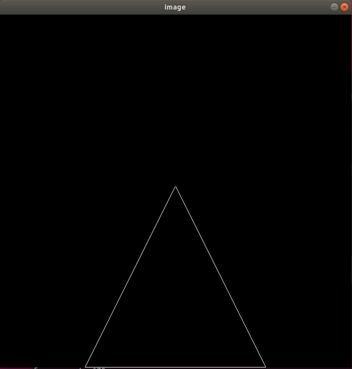
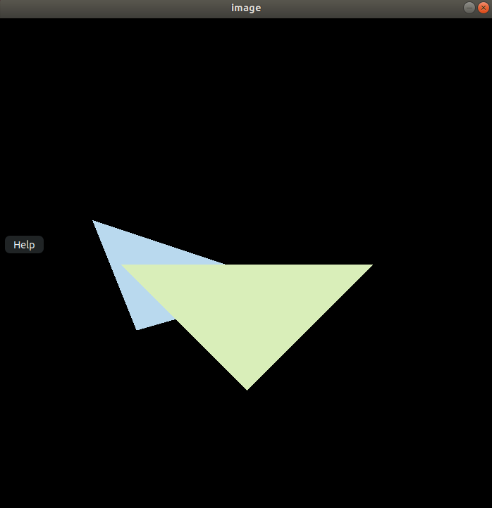

# GAMES101

## Intro to Computer Graphics

### Assignment 0

- Learn Eigen Lib
- Base operation about Vector and Matrix

### Assignment 1

- Matrix about Rotation/Scaling/Translation

- Projection matrix
-  [option] Rodrigues Rotation Formula

### Assignment 2

- Judge inside triangle with Cross Operation
- 2D Bounding box
- Rasterize Triangle
- [option] Super-Sampling Anti-Aliasing(MSAA)

____

video https://www.bilibili.com/video/BV1X7411F744

BBS http://games-cn.org/forums/forum/graphics-intro/

Homework page http://games-cn.org/forums/topic/allhw/

